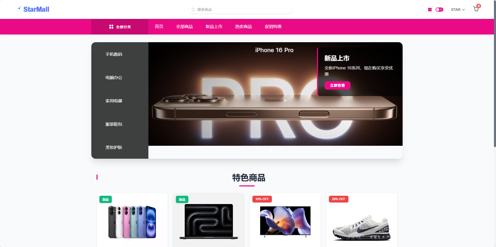
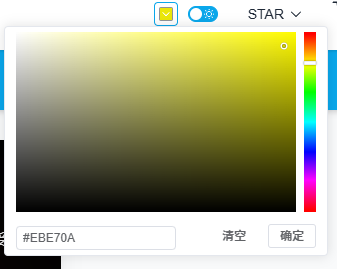

# StarMall 电商网站

基于 Vue3 + TypeScript + Element Plus 构建的现代电商网站，提供优质的购物体验。

## 项目特点

- 🎨 支持主题色个性化定制
- 🌓 深色/浅色模式切换
- 💾 购物车数据本地持久化
- ⚡️ 基于 Webpack 的服务端渲染
- 🔐 用户认证与授权系统
- 📱 响应式布局设计

## 主要功能

- 商品展示与搜索
- 购物车管理
- 用户注册与登录
- 订单结算
- 个人中心
- 主题定制

## 首页预览




## 多种主题配色，任君挑选



## 技术栈

- **前端框架：** Vue 3.3.4
- **类型支持：** TypeScript
- **UI 框架：** Element Plus 2.3.12
- **状态管理：** Pinia 2.1.6
- **路由管理：** Vue Router 4.2.4
- **数据请求：** Axios 1.5.0
- **服务端渲染：** @vue/server-renderer
- **构建工具：** Webpack 5
- **样式处理：** Sass


## 项目结构

```
├── public/          # 静态资源
├── server/          # 服务端渲染相关
├── src/
│   ├── assets/      # 项目资源文件
│   ├── components/  # 公共组件
│   ├── router/      # 路由配置
│   ├── stores/      # 状态管理
│   ├── types/       # TypeScript 类型定义
│   ├── views/       # 页面组件
│   ├── App.vue      # 根组件
│   └── main.ts      # 入口文件
└── package.json     # 项目配置文件
```

## 开发环境搭建

1. 克隆项目
```bash
git clone https://github.com/xcanhu/vueshopping.git
cd vueshopping
```

2. 安装依赖
```bash
npm install
```

3. 启动服务器
```bash
npm run server
```

4. 启动开发服务器
```bash
npm run dev
```

## 生产环境部署

1. 构建客户端资源
```bash
npm run build
```

2. 构建 SSR 资源（可选）
```bash
npm run build:ssr
```

3. 启动服务器
```bash
npm run server
```

## 浏览器支持

- Chrome >= 87
- Firefox >= 78
- Safari >= 14
- Edge >= 88

## 开源协议

MIT License
